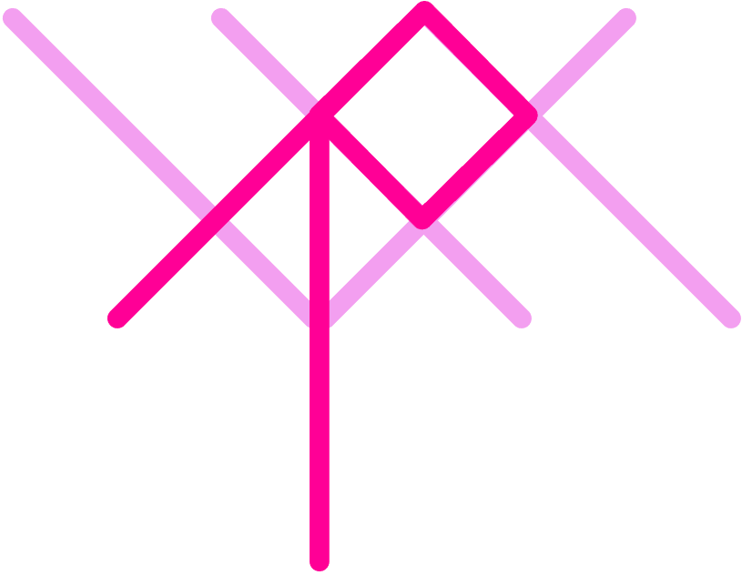

# Spider (Under Construction)
A simple and safer [AGSL](https://developer.android.com/develop/ui/views/graphics/agsl) wrapper library for compose functions that is generated by [ksp](https://github.com/google/ksp).

<div align="center">
    
</div>

## Background
[AGSL](https://developer.android.com/develop/ui/views/graphics/agsl) is a shader that defines the behavior of programmable shader objects.
When we use the AGSL, passing the raw string directly. It has a potential of runtime crash.
Spider will care that situations.

## Usage
0. Add dependency of this library.

build.gradle.kts
```kotlin
plugins {
    id("com.google.devtools.ksp").version("1.7.21-1.0.8")
}

android {
    sourceSets {
        getByName("debug") {
            kotlin.srcDirs("build/generated/ksp/debug/kotlin")
        }
        getByName("release") {
            kotlin.srcDirs("build/generated/ksp/release/kotlin")
        }
    }
}

dependencies {
    implementation("net.chigita.spider:spider-annotation:1.0.0-alpha01")
    ksp("net.chigita.spider:spider:1.0.0-alpha01")
}
```

1. Prepare `.agsl` file and save in `assets` directly.

<div align="center">
    
</div>

2. Define Compose function that refer to agsl file.

```kotlin
@Composable
fun ShaderBrushExample() {
    Box(modifier = Modifier
        .drawWithCache {
            val shaderBrush = ShaderBrush(shader)
            drawRect(shaderBrush)
        }.fillMaxSize()
    )
}
```

3. Add annotation `@AGSL(file_name)` for the composable function.

```kotlin
@Composable
@AGSL("test")
fun ShaderBrushExample() {
    // code snip...
}
```

4. You can refer the `.agsl` asset as `RuntimeShader`. This library automatically generates `RememberTestShader` composable function.

```kotlin
@Composable
@AGSL("test")
fun ShaderBrushExample() {
    val shader = RememberTestShader()
    Box(modifier = Modifier
        .drawWithCache {
            val shaderBrush = ShaderBrush(shader)
            drawRect(shaderBrush)
        }.fillMaxSize()
    )
}
```

## Plan

- [x] Annotation for enum support
- [x] Annotation with args support
- [ ] Pre syntax verify support
